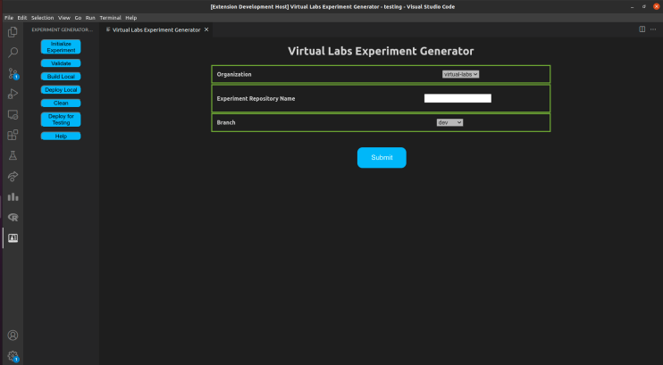

# Virtual Labs Experiment Authoring Plugin

Virtual Labs is an initiative by the Ministry of Education, Government of India that aims to provide remote-access to simulation-based Labs in various disciplines of Science and Engineering. It also provides free, laboratory learning experience to students through remote experimentation.

This is a Visual Studio Code extension for authoring Virtual Labs experiments in a streamlined and user friendly way. It provides options that handle all the common tasks involved in experiment development.

## Getting Started

1. Install the extension from the Visual Studio Code Marketplace by searching for "Virtual Labs Experiment Authoring Plugin".
2. Click on the extension icon on the left panel of Visual Studio Code.
3. You will see the following list of options on the left sidebar:
    * Initialize Experiment- By clicking on this you will be propmted to enter the Experiment Repository Name that you wish to initialize. Clicking on Submit will create and open a new folder inside the current folder with the name of the experiment repository name.
    * Validate- Validates the code with eslint and also validates the experiment descriptor based on a schema.
    * Build Local- Creates a build folder inside the experiment repository folder and builds the experiment locally.
    * Deploy Local- Deploys the experiment locally on a web browser for the user to test.
    * Clean- Deletes the build folder.
    * Deploy Testing- Pushes the experiment to testing branch of the experiment repository and deploys the experiment on the github pages of Virtual Labs.

