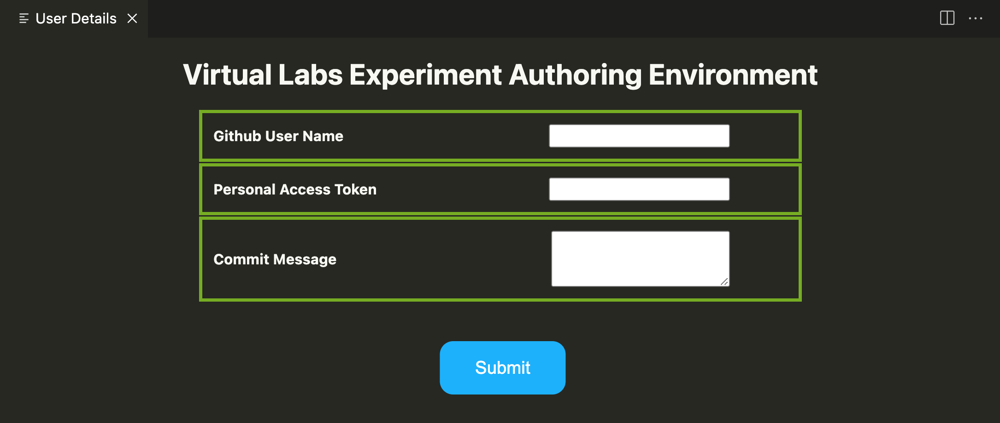

# Virtual Labs Experiment Authoring Environment

Virtual Labs is an initiative by the Ministry of Education, Government of India that aims to provide remote-access to simulation-based Labs in various disciplines of Science and Engineering. It also provides free, laboratory learning experience to students through remote experimentation.

This is a Visual Studio Code extension for authoring Virtual Labs experiments in a streamlined and user friendly way. It provides options that handle all the common tasks involved in experiment development.
## Getting Started

1. Install the extension from the Visual Studio Code Marketplace by searching for "Virtual Labs Experiment Authoring Environment".
2. Open a folder in Visual Studio Code where you wish to create the experiment repository.
3. Click on the extension icon on the left panel of Visual Studio Code.

    

4. You will see the following list of options on the left sidebar:
    * **Initialize Experiment**- By clicking on this you will be prompted to enter the Experiment Repository Name that you wish to initialize. Clicking on Submit will create and open a new folder inside the current folder with the name of the experiment repository name.
    
    * **Validate** - Validates the code with eslint and also validates the experiment descriptor based on a schema.
    * **Build Local** - Creates a build folder inside the experiment repository folder and builds the experiment locally.
    * **Deploy Local** - Deploys the experiment locally on a web browser for the user to test.
    * **Clean**- Deletes the build folder.
    * **Deploy for Testing**- Pushes the experiment to testing branch of the experiment repository and deploys the experiment on the github pages of Virtual Labs.
        - **Github User Name** - Here you have to enter your github username.
        - **Personal Access Token** - Here you have to enter your personal access token. You can generate a personal access token by following the steps given [here](https://docs.github.com/en/github/authenticating-to-github/creating-a-personal-access-token).
        - **Commit Message** - Here you can enter a short message describing the summary of the work you have done.
    
    

**Note**: 
- If there are multiple experiment folders in a directory, you will have to open the folder on VS Code on which you wish to work and this extension will work on that folder only.
- Before using the **Deploy for Testing** functionality of the extension, you need to have the write permissions to the repository.
- After initializing the experiment, the branch will be set to dev by default. Don't change the branch manually using command line/terminal as the extension takes care of it on it's own.
- Make sure that directory names don't contain spaces.
- Try to use the latest version of npm and nodejs. The minimum requirement for nodejs version is 16.0.0 .
- Also make sure that you have installed the latest version of Visual Studio Code.

## Developer Support

If you face any difficulty in using this extension or find any bug then you can perform the following steps
- Take a screenshot of the bug you encountered or the problem you got.
- Explain in brief the steps you performed before encountering the bug/problem and attach a screenshot of the same.
- Email us at [dev-support@vlabs.ac.in](dev-support@vlabs.ac.in).